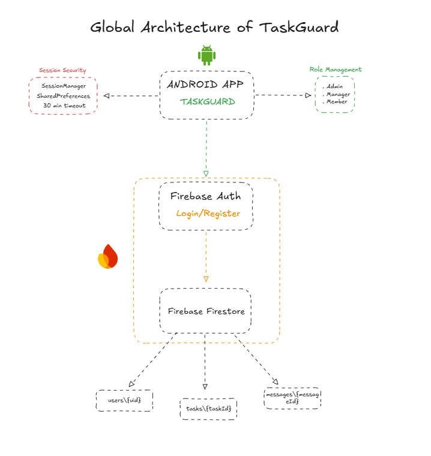

# TaskGuard

TaskGuard is a native Android task management application built with Java and Firebase. The app uses role-based access control so Admins, Managers, and Members each see the screens and actions that match their responsibility.

## Project Schema



## Main Features

- User registration and login with Firebase Authentication.
- Firestore user profiles with name, email, role, and profile image.
- Role-based routing after login.
- Admin dashboard for viewing users, changing roles, and deleting user profiles.
- Manager dashboard for viewing all tasks and creating new tasks.
- Member dashboard for viewing only assigned tasks.
- Member contact form for sending messages to admins.
- Profile screen with name editing and profile image upload.
- Custom navigation drawer with role-specific menu items.
- Session timeout after 30 minutes.
- Access verification through a zero-trust style role check.

## User Roles

### Admin

Admins can manage application users. They can view all registered users, cycle user roles between Admin, Manager, and Member, and delete user profile documents from Firestore.

### Manager

Managers can create tasks and view the full task list. A task is assigned to a member by email address.

### Member

Members can view tasks assigned to their own Firebase Auth email address. They can also contact admins by sending messages through the app.

## App Flow

```text
LoginActivity
  -> Firebase login
  -> MainActivity
  -> RoleManager checks Firestore user role
  -> AdminActivity | ManagerActivity | MemberActivity
```

New users register through `RegisterActivity`. After Firebase creates the account, the app creates a Firestore profile in the `users` collection with the default role `Member`.

## Firebase Collections

### `users`

Stores user profile and role data.

```json
{
  "name": "User Name",
  "email": "user@example.com",
  "role": "Admin | Manager | Member",
  "photoBase64": "optional-profile-image"
}
```

### `tasks`

Stores task records created by Managers.

```json
{
  "title": "Task title",
  "description": "Task description",
  "assignedTo": "member@example.com",
  "status": "pending",
  "createdBy": "manager@example.com"
}
```

### `messages`

Stores messages sent by Members to admins.

```json
{
  "from": "member@example.com",
  "message": "Message text",
  "timestamp": "Firebase timestamp"
}
```

## Important Source Files

```text
app/src/main/java/com/taskguard/activities/LoginActivity.java
app/src/main/java/com/taskguard/activities/RegisterActivity.java
app/src/main/java/com/taskguard/activities/MainActivity.java
app/src/main/java/com/taskguard/activities/AdminActivity.java
app/src/main/java/com/taskguard/activities/ManagerActivity.java
app/src/main/java/com/taskguard/activities/MemberActivity.java
app/src/main/java/com/taskguard/activities/CreateTaskActivity.java
app/src/main/java/com/taskguard/activities/ProfileActivity.java
app/src/main/java/com/taskguard/activities/ContactAdminActivity.java
app/src/main/java/com/taskguard/utils/RoleManager.java
app/src/main/java/com/taskguard/utils/SessionManager.java
app/src/main/java/com/taskguard/utils/ZeroTrustManager.java
app/src/main/java/com/taskguard/utils/DrawerController.java
app/src/main/java/com/taskguard/models/Task.java
```

## Tech Stack

- Java
- Android SDK
- Firebase Authentication
- Firebase Cloud Firestore
- Android RecyclerView
- Gradle

## Build

From the project root:

```bash
./gradlew assembleDebug
```

On Windows:

```powershell
.\gradlew.bat assembleDebug
```

The debug APK is generated at:

```text
app/build/outputs/apk/debug/app-debug.apk
```

## Requirements

- Android Studio or Android SDK installed.
- A Firebase project configured for Android.
- `app/google-services.json` present in the project.
- Firestore enabled.
- Firebase Authentication email/password provider enabled.

## Notes

- New registered users receive the `Member` role by default.

- `SessionManager` expires local sessions after 30 minutes.
- Task assignment currently uses the member email address in the `assignedTo` field.
